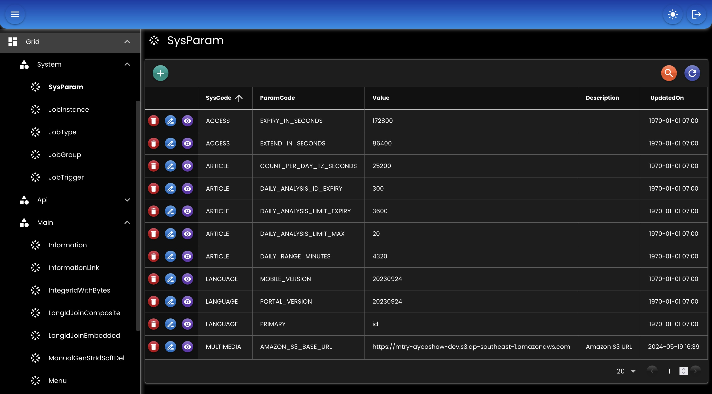

# Grid

- Definisi UI untuk memproses [CRUD](./02-crud.md) dalam format json/xml
- Aksi-aksi add, edit, delete juga didefinisikan
- Contoh file [grid / template](03-grid.json)

## Bean

``` java
@Bean
GridHandler gridHandler(
    AppProperties appProperties,
    DataMapper dataMapper,
    RedisTemplate<String, byte[]> redisTemplate
) {
    AppProperties.Grid grid = appProperties.getGrid();
    return new GridHandlerImpl()
    .setDataMapper(dataMapper)
    .setLocation(grid.getLocation())
    .setDefinition(grid.getDefinition())
    .setRedisTemplate(redisTemplate)
    .setAdditionals(GridSupport.getAdditionals())
    .setOptions(GridSupport.getOptions());
}
```

## Options

Daftar _option_ yang bisa digunakan oleh grid.

``` java
public interface GridOption {
    List<Option> getOption(ApplicationContext applicationContext); 
}

public class Option implements Serializable {
    private String value; 
    private String label;
    private String icon;
    private String description;
}

// Contoh
public static Map<String, GridOption> getOptions() {
    Map<String, GridOption> options = new HashMap<>();
    options.put("CRUD_CONDITION", StaticOption.CRUD_CONDITION);
    options.put("GENDER", StaticOption.GENDER);
    options.put("YES_NO", StaticOption.YES_NO);
    options.put("USER_STATUS", StaticOption.USER_STATUS);
    options.put("MENU_TYPE", StaticOption.MENU_TYPE);
    return options;
}
```

## Additionals

Daftar _additional_ yang bisa digunakan oleh grid.

``` java
public interface GridAdditional {
    ArrayNode getAdditional(ApplicationContext applicationContext);
}

// Contoh
public static Map<String, GridAdditional> getAdditionals() {
    Map<String, GridAdditional> additionals = new HashMap<>();
    additionals.put("DAYS", StaticAdditional.DAYS);
    additionals.put("MONTHS", StaticAdditional.MONTHS);
    return additionals;
}
```

## Screenshot

<div align="center">
   
</div>
