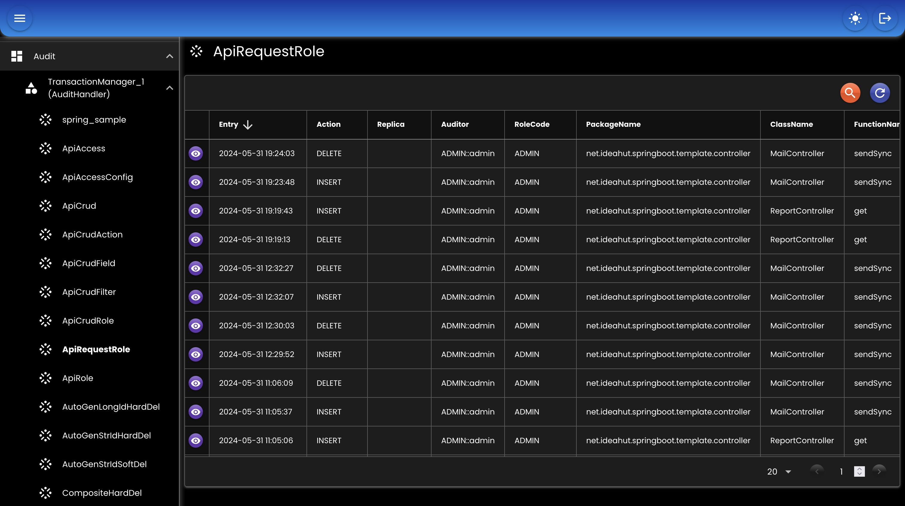

<div align="center">
   
</div>

# Audit
Untuk menyimpan perubahan data entity/model.
Akan disimpan tanggal perubahan, pengubah/user, aksi (INSERT / UPDATE / DELETE), dan data perubahan.
Proses penyimpanan akan dilakukan asinkronus.

## Multi
Semua table entity (yang ada anotasi @Audit) akan diduplikat, ditambah dengan field tanggal, pengubah, dan aksi.
``` java
@Bean
protected AuditHandler auditHandler(
    EntityTrxManager entityTrxManager,
    @Qualifier(AppConstants.Bean.Task.AUDIT) TaskHandler taskHandler
) {
    return new DatabaseMultiAuditHandler()
    .setEntityTrxManager(entityTrxManager)
    .setProperties(appProperties.getAudit().getProperties())
    .setTaskHandler(taskHandler)
    .setRejectNonAuditEntity(true);
}
```

## Single
Satu TransactionManager hanya disimpan ke satu table. Jadi semua perubahan entity/model akan disimpan ke satu table.
``` java
@Bean
protected AuditHandler auditHandler(
    EntityTrxManager entityTrxManager,
    @Qualifier(AppConstants.Bean.Task.AUDIT) TaskHandler taskHandler
) {
    return new DatabaseSingleAuditHandler()
    .setEntityTrxManager(entityTrxManager)
    .setProperties(appProperties.getAudit().getProperties())
    .setTaskHandler(taskHandler);
}
```

## Properties
``` java
public class DatabaseAuditProperties implements Serializable {	
	private Table table;
	private Column column;
	private Enable enable;
	private Generate generate;	
	private Length length;
	
	@Setter
	@Getter
	public static class Table implements Serializable {
		private String prefix; // prefix table yang akan digenerate
		private String suffix; // suffix table yang akan digenerate
	}		
	
	@Setter
	@Getter
	public static class Column implements Serializable {
		private String replica; // nama tabel kolom replica
		private String actor;   // nama tabel kolom actor
		private String action;  // nama tabel kolom action
		private String info;    // nama tabel kolom info
		private String entry;   // nama tabel kolom entry
	}
	
	@Setter
	@Getter
	public static class Length implements Serializable {
		private Integer id;         // panjang karakter tabel kolom id
		private Integer type;       // panjang karakter tabel kolom type
		private Integer action;     // panjang karakter tabel kolom action
		private Integer auditor;    // panjang karakter tabel kolom auditor
		private Integer info;       // panjang karakter tabel kolom info
	}
	
	@Setter
	@Getter
	public static class Enable implements Serializable {
		private Boolean audit;  // enable audit
		private Boolean rowid;  // enable rowid
		private Boolean index;  // enable index (setiap index akan direplika)
		private Boolean any;
	}		
	
	@Setter
	@Getter
	public static class Generate implements Serializable {
		private Boolean table;          // otomatis buat table atau tidak
		private Integer maxPrecision;   // maksimum precision
		private Integer maxScale;       // maksimum scale
	}
	
}
```