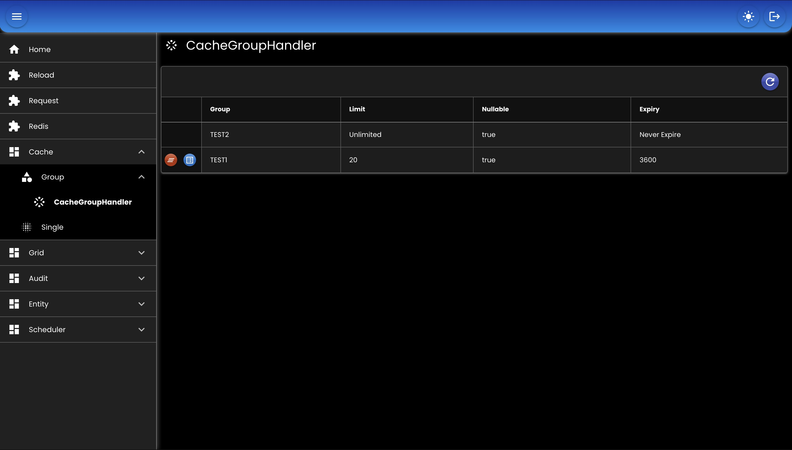

# Cache

Menyimpan data ke memori atau redis.

## Group

### Bean

``` java
@Bean
CacheGroupHandler cacheGroupHandler(
    DataMapper dataMapper,
    RedisTemplate<String, byte[]> redisTemplate,
    TaskHandler taskHandler
) throws Exception {
    return new RedisCacheGroupHandler()
    .setDataMapper(dataMapper)
    .setGroups(appProperties.getCache().getGroups())
    .setRedisTemplate(redisTemplate)
    .setTaskHandler(taskHandler);
}
```

### Properties

``` md
cache:
      groups:
         - name: TEST1
           limit: 20
           expiry: 3600
           nullable: true
         - name: TEST2
           limit: -1
           expiry: 0
           nullable: true
```

* `name` nama group
* `limit` maksimal jumlah key yang disimpan
* `expiry` kadaluarsa dalam detik
* `nullable` data null disimpan atau tidak

## Single

### Bean

``` java
@Bean
CacheHandler cacheHandler(
    DataMapper dataMapper,
    RedisTemplate<String, byte[]> redisTemplate,
    TaskHandler taskHandler
) throws Exception {
    return new RedisCacheHandler()
    .setDataMapper(dataMapper)
    .setRedisTemplate(redisTemplate)
    .setTaskHandler(taskHandler)
    .setLimit(100)
    .setNullable(true)
    .setPrefix("_test");
}
```

## Screenshot

<div align="center">
   
</div>
