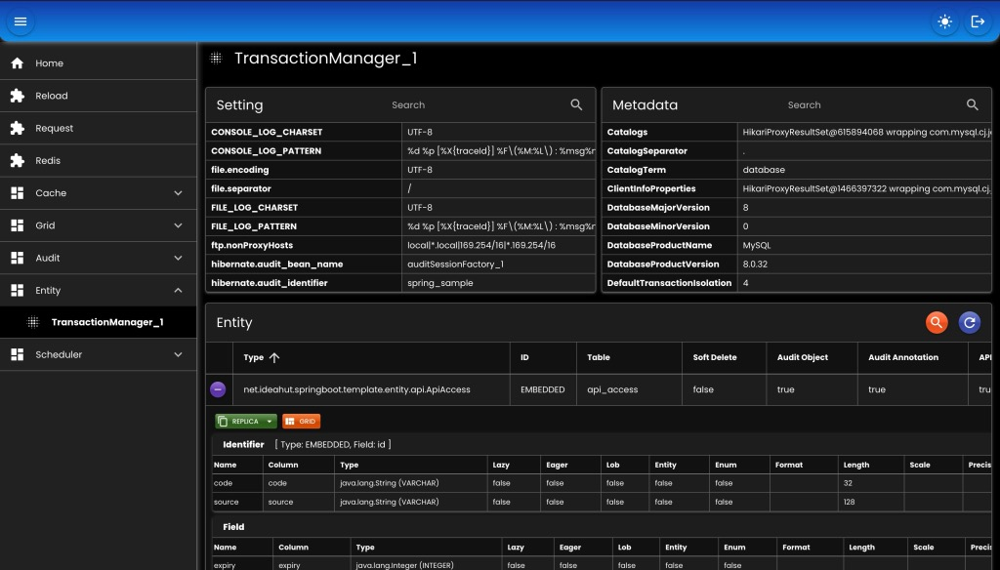

# Entity Transaction Manager

* Mengumpulkan informasi semua entity / model dari _Transaction Manager_ yang ada (bisa lebih dari satu _Transaction Manager_).
* Dapat digunakan untuk transaksi tanpa menggunakan DAO _Repository_.
* Digunakan di [CRUD](./07-crud.md), [Audit](./09-audit.md), & [Grid](./08-grid.md).
* Mendukung hibernate query (hql) maupun native query (sql).
* Mendukung _replica_ (satu entity dimapping ke banyak table), contoh: entity User di-_mapping_ ke table user_1, user_2, user_3, dst.

## Bean

``` java
@Bean
EntityTrxManager entityTrxManager(
    AppProperties appProperties
) {
    return new EntityTrxManagerImpl()
    
    // Entity / Model yang tidak memiliki anotasi @ApiExclude, dan tidak ingin dipublikasikan oleh ApiService
    .setApiExcludeParams(
        new EntityApiExcludeParam()
        .addEntityClasses(ModuleApi.getApiExcludeEntities())
        .addEntityClasses(ModuleJob.getApiExcludeEntities())
        .addEntityClasses(
            SysParam.class,
            Language.class,
            Message.class
        )
    )
    
    // Entity / Model yang tidak memiliki anotasi @Audit, dan ingin setiap perubahannya disimpan
    .setAuditParams(
        new EntityAuditParam()
        .addEntityClasses(ModuleApi.getAuditEntities())
        .addEntityClasses(ModuleJob.getAuditEntities())
        .addEntityClasses(
            SysParam.class,
            Language.class,
            Message.class
        )
    )
    
    // Daftar EntityPreListener & EntityPostListener, secara default akan dideteksi otomatis dari application context
    .setEntityListenerParam(
        new EntityListenerParam()
        .setAutoDetect(null)
        .setPostListeners(null)
        .setPreListeners(null)		
    )
    
    // Parameter untuk menghandle anotasi @ForeignKeyEntity
    // Ini solusi jika terjadi error saat membuat native image dimana entity memiliki @ManyToOne & @OneToMany
    // tapi package-nya berbeda dengan package project (error ByteCodeProvider saat runtime)
    .setForeignKeyParam(appProperties.getForeignKey());
}
```

* `setApiExcludeParams`: Entity / Model yang tidak memiliki anotasi @ApiExclude, dan tidak ingin dipublikasikan di ApiService.
* `setAuditParams`: Entity / Model yang tidak memiliki anotasi @Audit, dan ingin setiap perubahannya disimpan.
* `setEntityListenerParam`: Daftar EntityPreListener & EntityPostListener, secara default akan di-_detect_ otomatis dari semua bean yang ada _applicationContext_.
* `setForeignKeyParam`: Untuk menghandle anotasi @ForeignKeyEntity yang ada di entity / model.

## Tipe ID

### `STANDARD` satu id untuk satu entity

``` java
public class User extends EntityAuditSoftDelete {
    @Id
    @GeneratedValue(generator = OdtIdGenerator.NAME)
    @GenericGenerator(name = OdtIdGenerator.NAME, strategy = OdtIdGenerator.STRATEGY)
    @Column(name = "user_id", unique = true, nullable = false, length = 64)
    private String userId;
}
```

### `COMPOSITE` multi id untuk satu entity

``` java
public class CompositeHardDel extends EntityAudit {
    @Id
    @Column(name = "type", nullable = false)
    private Integer type;
    @Id
    @Column(name = "code", length = 3, nullable = false)
    private String code;
}
```

### `EMBEDDED` multi id yang didefinisikan ke satu object untuk di-_embed_ ke entity

``` java
public class EmbededId implements java.io.Serializable {
    @Column(name = "type", nullable = false)
    private Integer type;
    @Column(name = "code", length = 3, nullable = false)
    private String code;
}

public class EmbeddedHardDel extends EntityAudit {
    @EmbeddedId
    @AttributeOverride(name = "type", column = @Column(name = "type", nullable = false))
    @AttributeOverride(name = "code", column = @Column(name = "code", nullable = false))
    private EmbededId id;
}
```

## Contoh Transaksi

``` java
TrxManagerInfo trxManagerInfo = entityTrxManager.getDefaultTrxManagerInfo();
User user = trxManagerInfo.transaction(new SessionCallable<User>() {
    @Override
    public User call(Session session) throws Exception {
        return session.get(User.class, "user_id");
    }
});
```

## PreListener

Listener sebelum entity mengalami perubahan (INSERT, UPDATE, & DELETE).
Contoh penggunaan di [cache](./10-cache.md), untuk membuang data yang tersimpan di memori.

``` java
public interface EntityPreListener { 
    default void onPreInsert(Object entity) {}
	default void onPreUpdate(Object entity) {}
	default void onPreDelete(Object entity) {}
}
```

## PostListener

Listener setelah entity mengalami perubahan (INSERT, UPDATE, & DELETE).
Contoh penggunaan di [audit](./09-audit.md), untuk menyimpan data perubahan ke audit handler.

``` java
public interface EntityPostListener {
    default void onPostInsert(Object entity) {}
	default void onPostUpdate(Object entity) {}
	default void onPostDelete(Object entity) {}
}
```

## Screenshot

<div>
   
</div>

##

### [Index](./index.md)
