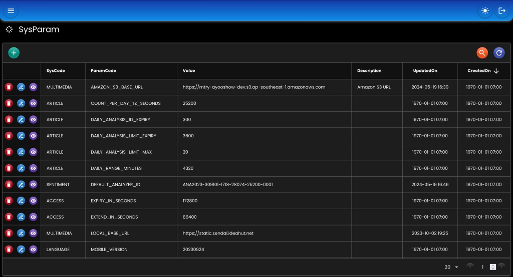

# System Parameter

Menyimpan konfigurasi aplikasi ke database dan redis.
``` java
// SysParamHandler
public interface SysParamHandler {
	SysParamDto getSysParam(String sysCode, String paramCode);
	SysParamMapDto getSysParamMap(String sysCode);
	Map<String, SysParamMapDto> getSysParamMaps(String... sysCodes);
	
	<T> T getValue(Class<T> type, String sysCode, String paramCode, T defaultValue);
	<T> T getValue(Class<T> type, String sysCode, String paramCode);
	
	<T> T getValue(Class<T> type, Map<String, SysParamDto> sysMap, String paramCode, T defaultValue);
	<T> T getValue(Class<T> type, Map<String, SysParamDto> sysMap, String paramCode);
	
	byte[] getBytes(String sysCode, String paramCode, byte[] defaultValue);
	byte[] getBytes(String sysCode, String paramCode);
}

// SysParamRemover
public interface SysParamRemover {
	void removeSysCodes(String... sysCodes);
	void removeSysParam(String sysCode, String paramCode);
}

// SysParamReloader
public interface SysParamReloader {
	void reloadSysCodes(String... sysCodes);
}

// SysParamUpdater
public interface SysParamUpdater {
	void updateSysParam(SysParamDto sysParamDto);
}
```
## Bean

``` java
@Bean
SysParamHandler sysParamHandler(
    BinarySerializer binarySerializer,
    RedisTemplate<String, byte[]> redisTemplate,
    EntityTrxManager entityTrxManager
) {
    return new SysParamHandlerImpl()
            
    // Serialize & deserialize byte array ke redis		
    .setBinarySerializer(binarySerializer)
    
    // Daftar Entity class dan nama trxManager yang terkait dengan SysParamHandler
    // default semua class di package 'net.ideahut.springboot.sysparam.entity'
    .setEntityClass(null)
    
    // EntityTrxManager
    .setEntityTrxManager(entityTrxManager)
    
    // RedisTemplate dan definisi penyimpanan key-nya
    .setRedisParam(
        new RedisParam<String, byte[]>()	
        .setAppIdEnabled(true)
        .setEncryptEnabled(true)
        .setPrefix("SYS-PARAM")
        .setRedisTemplate(redisTemplate)
    );
}
```

* `setBinarySerializer`: [BinarySerializer](./03-binary.md) bean.
* `setEntityTrxManager`: [EntityTrxManager](./05-entity.md) bean.
* `setEntityClass`: Nama class entity SysParam.
* `setRedisParam`: Redis parameter, termasuk [RedisTemplate](./15-redis.md) dan prefix key-nya.

## Contoh

``` java
@Autowired
private SysParamHandler sysParamHandler;

@Public
@GetMapping("/sysparam/value")
String value() throws Exception {
    return sysParamHandler.getValue(String.class, "API-TOKEN", "SERVICE-ACCOUNT");
}

@Public
@GetMapping("/sysparam/maps")
Map<String, SysParamMapDto> sysParamMaps() throws Exception {
    return sysParamHandler.getSysParamMaps("ARTICLE", "MULTIMEDIA");
}

@Public
@GetMapping("/sysparam/value")
SysParamDto sysParamValue() {
    return sysParamHandler.getSysParam("SENTIMENT", "DEFAULT_ANALYZER_ID");
}

@Public
@GetMapping("/sysparam/reloadSysCodes")
void reloadSysCodes() {
    ((SysParamReloader) sysParamHandler).reloadSysCodes("ARTICLE", "MULTIMEDIA");
}

@Public
@GetMapping("/sysparam/removeSysCodes")
void removeSysCodes() {
    ((SysParamRemover) sysParamHandler).removeSysCodes("ARTICLE", "MULTIMEDIA");
}

@Public
@GetMapping("/sysparam/reloadSysParam")
void reloadSysParam() {
    ((SysParamReloader) sysParamHandler).reloadSysParam("SENTIMENT", "DEFAULT_ANALYZER_ID");
}

@Public
@GetMapping("/sysparam/removeSysParam")
void removeSysParam() {
    ((SysParamRemover) sysParamHandler).removeSysParam("SENTIMENT", "DEFAULT_ANALYZER_ID");
}
```

## Screenshot

<div>
   
</div>

##

### [Index](./index.md)

