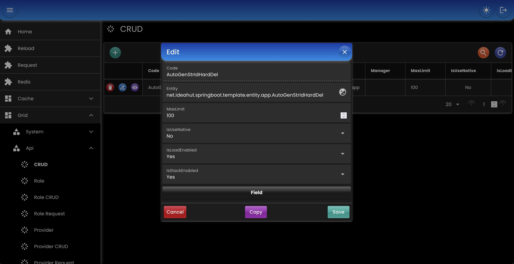

# CRUD

- Secara otomatis semua entity / model yang terdeteksi oleh [EntityTrxManager](./05-entity.md) dapat diakses menggunakan modul ini.
- Untuk membatasi akses dapat dipasangkan dengan ApiRole (lihat: modul [API](./18-api.md)).

## Bean

- `CrudHandler`: menangani pengambilan resource, permission, dan eksekusi.
- `CrudResource`: mendapatkan CrudProperties yang akan dieksekusi oleh `CrudHandler`.
- `CrudPermission`: mengecek apakah eksekusi diijinkan atau tidak.

``` java
@Bean
CrudHandler crudHandler(
    AppProperties appProperties,
    EntityTrxManager entityTrxManager,
    DataMapper dataMapper,
    CrudResource resource,
    CrudPermission permission
) {
    CrudDefinition crud = ObjectHelper.useOrDefault(
        appProperties.getCrud(), 
        CrudDefinition::new
    );
    return new CrudHandlerImpl()
            
    // semua query menggunakan sql (native) atau tidak
    .setAlwaysUseNative(crud.getAlwaysUseNative())
    
    // maksimum jumlah data saat retrieve (PAGE, LIST, MAP)
    .setDefaultMaxLimit(crud.getDefaultMaxLimit())
    
    // EntityTrxManager
    .setEntityTrxManager(entityTrxManager)
    
    // CrudPermission
    .setPermission(permission)
    
    // CrudResource
    .setResource(resource)
    
    // Daftar filter specific yang akan disertakan saat query
    // Contoh penggunaan, hanya menampilkan data yang terkait dengan user yang login
    .setSpecificValueGetters(CrudSupport.getSpecificValueGetters());
    
}}

// Contoh CrudResource berdasarkan nama class yang didefinisikan di CrudRequest
@Bean
CrudResource crudResource(
    EntityTrxManager entityTrxManager
) {
    return new CrudResource() {
        @Override
        public CrudProps getCrudProps(String manager, String name) {
            try {
                Class<?> clazz = ObjectHelper.classOf(EntityFill.class.getPackageName() + "." + name);
                TrxManagerInfo trxManagerInfo = entityTrxManager.getDefaultTrxManagerInfo();
                if (manager != null && !manager.isEmpty()) {
                    trxManagerInfo = entityTrxManager.getTrxManagerInfo(manager);
                }
                EntityInfo entityInfo = trxManagerInfo.getEntityInfo(clazz);
                CrudProps resource = new CrudProps();
                resource.setEntityInfo(entityInfo);
                resource.setMaxLimit(200);
                resource.setUseNative(false);
                return resource;
            } catch (Exception e) {
                throw FrameworkUtil.exception(e);
            }
        }
    };
}

// Contoh CrudResource yang diambil menggunakan ApiService
@Bean
CrudResource crudResource(
    ApiService apiService
) {
    return (manager, name) -> {
        ApiAccess apiAccess = ApiAccess.fromContext();
        CrudProperties properties = apiService.getApiCrudProperties(apiAccess, name);
        Assert.notNull(properties, "CrudProperties is not found: " + name);
        return properties;
    };
}

// Contoh CrudPermission mengijinkan semua CrudRequest
@Bean
CrudPermission crudPermission() {
    return (action, request) -> true;
}

// Contoh CrudPermission yang mengecek apakah action didefinisikan di table / ApiService
@Bean
CrudPermission crudPermission() {
    return (action, request) -> {
        CrudProperties properties = request.getProperties();
        Set<CrudAction> actions = properties.getActions();
        return actions != null && actions.contains(action);
    };
}
```

## Controller

``` java
// WebMvc
@RestController
@RequestMapping("/crud")
class CrudController extends net.ideahut.springboot.crud.WebMvcCrudController {
    
    @PostMapping(value = "/action/{action}")
    Result action(
        @PathVariable("action") String action, 
        HttpServletRequest request
    ) throws Exception {
        byte[] data = WebMvcHelper.getBodyAsBytes(request);
        return super.body(CrudAction.valueOf(action.toUpperCase()), data);
    }
}

// WebFlux
@RestController
@RequestMapping("/crud")
class CrudController extends net.ideahut.springboot.crud.WebFluxCrudController {
    
    @PostMapping(value = "/action/{action}")
	Mono<Result> action(
		@PathVariable("action") String action,
		ServerHttpRequest httpRequest
	) {
		return WebFluxHelper
		.onRequestBody(httpRequest)
		.flatMap(bytes -> {
			Result result = super.body(CrudAction.valueOf(action.toUpperCase()), bytes);
			return Mono.just(result);
		});
	}
}
```

## Action

- `UNIQUE` mendapatkan satu data unik (akan error jika data lebih dari satu).
- `SINGLE` mendapatkan hanya satu data.
- `PAGE` mendapatkan koleksi data disertai informasi halaman.
- `LIST` mendapatkan koleksi data.
- `MAP` mendapatkan koleksi data dalam bentuk _key_-_value_.
- `CREATE` membuat data baru.
- `UPDATE` memperbaharui data yang sudah ada.
- `SAVE` membuat / memperbaharui data.
- `DELETE` menghapus satu data.
- `DELETES` menghapus koleksi data.

## Condition

- `ANY_LIKE` mengandung kalimat / kata (huruf besar / kecil tidak masalah).
- `ANY_START` dimulai dengan kalimat / kata (huruf besar / kecil tidak masalah).
- `ANY_END` diakhiri dengan kalimat / kata (huruf besar / kecil tidak masalah).
- `ANY_EQUAL` sama dengan kalimat / kata (huruf besar / kecil tidak masalah).
- `LIKE` mengandung kalimat / kata.
- `START` dimulai dengan kalimat / kata.
- `END` diakhiri dengan kalimat / kata.
- `NOT_ANY_LIKE` tidak mengandung kalimat / kata (huruf besar / kecil tidak masalah).
- `NOT_ANY_START` tidak dimulai dengan kalimat / kata (huruf besar / kecil tidak masalah).
- `NOT_ANY_END` tidak diakhiri dengan kalimat / kata (huruf besar / kecil tidak masalah).
- `NOT_ANY_EQUAL` tidak sama dengan kalimat / kata (huruf besar / kecil tidak masalah).
- `NOT_LIKE` tidak mengandung kalimat / kata.
- `NOT_START` tidak dimulai dengan kalimat / kata.
- `NOT_END` tidak diakhiri dengan kalimat / kata.
- `NOT_EQUAL` tidak sama dengan.
- `BETWEEN` diantara, min - max.
- `NOT_NULL` bukan null.
- `IS_NULL` hanya yang null.
- `GREATER_THAN` lebih besar.
- `GREATER_EQUAL` lebih besar atau sama dengan.
- `LESS_THAN` lebih kecil.
- `LESS_EQUAL` lebih kecil atau sama dengan.
- `IN` hanya yang di dalam.
- `NOT_IN` selain yang di dalam.
- `EQUAL` sama dengan.

## Request

- `name` nama resource.
- `manager` nama transaction manager.
- `replica` nomor table dari entity.
- `ids` array id entity.
- `id` id entity.
- `map` definisi key-value untuk action MAP.
- `page` informasi halaman.
- `start` start offset.
- `limit` batas jumlah data.
- `filters` array filter.
- `orders` array order (descending dimulai dengan karakter '-').
- `fields` daftar field yang ditampilkan.
- `excludes` daftar field yang tidak ditampilkan.
- `loads` daftar field yang datanya diambil dari entity lain (_Lazy Load_).
- `values` array value, untuk insert & update.
- `joins` array join dengan entity lain.
- `stacks` array stack, proses bertingkat. Contoh: setelah user disimpan, bisa dilanjutkan dengan menyimpan data detail atau otentikasi.

### Page

``` js
{
    "name": "AutoGenStrIdHardDel",
    "page": {
        "index": 1,
        "size": 10,
        "count": true
    },
    "filters": [
        {
            "field": "name",
            "condition": "NOT_NULL"
        },
        {
            "field": "date",
            "condition": "BETWEEN",
            "values": ["2025-01-01 00:00:00", "2025-01-31 23:59:59"]
        }
    ],
    "orders":["-createdOn"]
}

// Contoh menggunakan replica
{
    "name": "Information",
    "replica": 1,
    "page": {
        "index": 1,
        "size": 100,
        "count": true
    },
    "orders":["-createdOn"]
}
```

### Map

``` js
{
    "name": "AutoGenStrIdHardDel",
    "start": 0,
    "limit": 10,
    "map": {
        "keys": ["id", "name"],
        "flat": true
    },
    "filters": [
        {
            "field": "createdOn",
            "condition": "not_null"
        }        
    ],
    "orders":["-createdOn"]

}
```

### Unique

``` js
{
    "name": "AutoGenStrIdHardDel",
    "id": "2024-102085-1930-22404-25200-0000"
}
```

### Create

``` js
{
    "name": "AutoGenStrIdHardDel",
    "value": {
        "name": "COBA",
        "isActive": "Y",
        "description": "description",
        "date": "2024-01-02 18:43:24",
        "condition": "ANY_LIKE"
    }
}
```

### Update

``` js
{
    "name": "AutoGenStrIdHardDel",
    "id": "2024-102107-1544-16584-25200-0001",
    "value": {
        "name": "yyyyyTest (Edited)",
        "description": null,
        "date": "2024-01-03 18:00:02",
        "condition": "BETWEEN"
    }
}
```

### Delete

``` js
{
    "name": "AutoGenStrIdHardDel",
    "id": "2024-102037-1717-17536-25200-0001"
}
```

### Deletes

``` js
{
    "name": "AutoGenStrIdHardDel",
    "ids": [
        "2024-204067-1553-20523-25200-0000",
        "2024-101056-1708-46195-25200-0001",
        "2024-101056-1711-09428-25200-0002"
    ]
}
```

## Screenshot

<div>
   
</div>

##

### [Index](./index.md)
