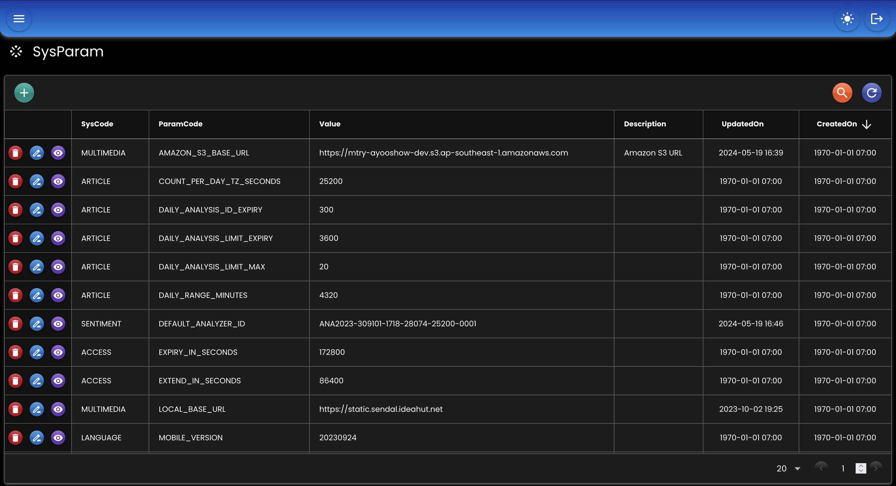

<div align="center">
   
</div>

# SysParam
Menyimpan konfigurasi aplikasi ke database dan redis.

## Bean
``` java
@Bean
protected SysParamHandler sysParamHandler(
    DataMapper dataMapper,
    RedisTemplate<String, byte[]> redisTemplate,
    EntityTrxManager entityTrxManager
) {
    return new SysParamHandlerImpl()
    .setDataMapper(dataMapper)
    .setEntityTrxManager(entityTrxManager)
    .setEntityClass(new SysParamHandlerImpl.EntityClass()
        .setSysParam(SysParam.class)	
    )
    .setRedisTemplate(redisTemplate);
}
```
* `dataMapper` Data Mapper bean.
* `entityTrxManager` EntityTrxManager bean.
* `entityClass` Nama class entity SysParam.
* `redisTempate` RedisTemplate bean.

## Contoh
``` java
@Autowired
private SysParamHandler sysParamHandler;

@Public
@GetMapping("/sysparam/maps")
protected Map<String, Map<String, EntSysParam>> sysParamMaps() throws Exception {
    return sysParamHandler.getSysParamMaps("ARTICLE", "MULTIMEDIA");
}

@Public
@GetMapping("/sysparam/value")
protected EntSysParam sysParamValue() {
    return sysParamHandler.getSysParam("SENTIMENT", "DEFAULT_ANALYZER_ID");
}

@Public
@GetMapping("/sysparam/reloadSysCodes")
protected void reloadSysCodes() {
    ((SysParamReloader) sysParamHandler).reloadSysCodes("ARTICLE", "MULTIMEDIA");
}

@Public
@GetMapping("/sysparam/removeSysCodes")
protected void removeSysCodes() {
    ((SysParamRemover) sysParamHandler).removeSysCodes("ARTICLE", "MULTIMEDIA");
}

@Public
@GetMapping("/sysparam/reloadSysParam")
protected void reloadSysParam() {
    ((SysParamReloader) sysParamHandler).reloadSysParam("SENTIMENT", "DEFAULT_ANALYZER_ID");
}

@Public
@GetMapping("/sysparam/removeSysParam")
protected void removeSysParam() {
    ((SysParamRemover) sysParamHandler).removeSysParam("SENTIMENT", "DEFAULT_ANALYZER_ID");
}
```