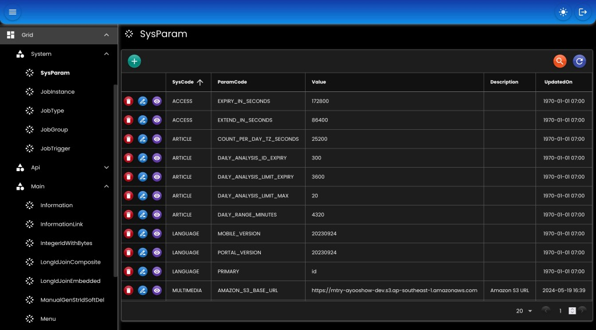

# Grid

- Definisi _user interface (UI)_ untuk menampilkan [CRUD](./07-crud.md) dalam format json atau yaml.
- Aksi-aksi add, edit, delete juga didefinisikan.
- Contoh file [json](./assets/grid.json) atau [yaml](./assets/grid.yaml).

``` java
public interface GridHandler {
	List<GridParent> getTree();
	JsonNode getGrid(String parent, String name);
	void translate(JsonNode grid);
}
```

## Bean

``` java
@Bean
GridHandler gridHandler(
    AppProperties appProperties,
    BinarySerializer binarySerializer,
    RedisTemplate<String, byte[]> redisTemplate
) {
    GridDefinition grid = ObjectHelper.useOrDefault(
        appProperties.getGrid(), 
        GridDefinition::new
    );
    return new GridHandlerImpl()
    .setBinarySerializer(binarySerializer)
    .setDefinition(grid.getDefinition())
    .setLocation(grid.getLocation())
    .setMessageHandler(null)
    .setRedisTemplate(!Boolean.TRUE.equals(grid.getUseLocalMemory()) ? redisTemplate : null)
    .setStorageKeyParam(grid.getStorageKeyParam())
    .setAdditionals(GridSupport.getAdditionals())
    .setOptions(GridSupport.getOptions());
```

- `setBinarySerializer`: [BinarySerializer](./03-binary.md) bean.
- `setDefinition`: Definisi grid sebagai alternatif jika diset di konfigurasi / properties.
- `setLocation`: Directory lokasi file-file template grid.
- `setMessageHandler`: Untuk menerjemahkan judul, label, deskripsi, dll yang ada di template grid.
- `setRedisTemplate`: [RedisTemplate](./15-redis.md) bean.
- `setAdditionals`: Daftar array yang digunakan di template grid, contoh: DAYS, MONTHS, dll.
- `setOptions`: Daftar option select ynag digunakan di template grid, contoh: GENDER, BOOLEAN, dll.

## Options

Daftar _option_ yang bisa digunakan oleh grid.

``` java
public interface GridOption {
	List<Option> getGridOptionItems();
}

public class Option implements Serializable {
    private String value; 
    private String label;
    private String icon;
    private String description;
}

// Contoh
public static Map<String, GridOption> getOptions() {
    Map<String, GridOption> options = new HashMap<>();
    options.put("GENDER", StaticOption.GENDER);
    options.put("YES_NO", StaticOption.YES_NO);
    return options;
}
public static class StaticOption {
    // GENDER
    public static final GridOption GENDER =  new GridOptionFromCollector(() ->
        Arrays.asList(
            Option.of("M", "Male"),
            Option.of("F", "Female")
        )
    );
    // YES_NO
    public static final GridOption YES_NO =  new GridOptionFromCollector(() ->
        Arrays.asList(
            Option.of("Y", "Yes"),
            Option.of("N", "No")
        )
    );
}
```

## Additionals

Daftar _additional_ yang bisa digunakan oleh grid.

``` java
public interface GridAdditional {
	ArrayNode getGridAdditionalItems();
}

// Contoh
public static Map<String, GridAdditional> getAdditionals() {
    Map<String, GridAdditional> additionals = new HashMap<>();
    additionals.put("DAYS", StaticAdditional.DAYS);
    return additionals;
}
public static class StaticAdditional {
    // DAYS
    public static final GridAdditional DAYS =  new GridAdditionalFromCollector(() ->
        String str = "[\"Sunday\", \"Monday\", \"Tuesday\", \"Wednesday\", \"Thursday\", \"Friday\", \"Saturday\", \"Sun\", \"Mon\", \"Tue\", \"Wed\", \"Thu\", \"Fri\", \"Sat\"]";
		return FrameworkHelper.defaultDataMapper().read(str, ArrayNode.class);
    );
}
```

## Screenshot

<div>
   
</div>

##

### [Index](./index.md)
