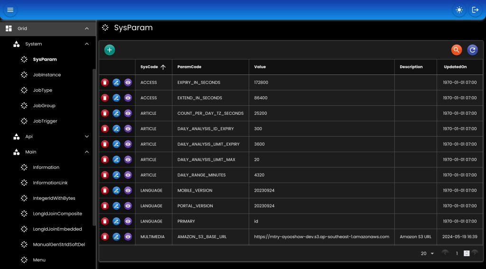

# Grid

- Definisi _user interface (UI)_ untuk menampilkan [CRUD](./07-crud.md) dalam format json atau yaml.
- Aksi-aksi add, edit, delete juga didefinisikan.
- Contoh file [json](./assets/grid.json) atau [yaml](./assets/grid.yaml).

``` java
public interface GridHandler {
	List<GridParent> getTree();
	JsonNode getGrid(String parent, String name);
	void translate(JsonNode grid);
}
```

## Bean

``` java
@Bean
GridHandler gridHandler(
    AppProperties appProperties,
    DataMapper dataMapper,
    RedisTemplate<String, byte[]> redisTemplate
) {
    AppProperties.Grid grid = appProperties.getGrid();
    return new GridHandlerImpl()
    .setDataMapper(dataMapper)
    .setLocation(grid.getLocation())
    .setDefinition(grid.getDefinition())
    .setMessageHandler(null)
    .setRedisTemplate(redisTemplate)
    .setAdditionals(GridSupport.getAdditionals())
    .setOptions(GridSupport.getOptions());
}
```

- `setDataMapper`: [Data Mapper](./02-mapper.md) bean.
- `setLocation`: Directory lokasi file-file template grid.
- `setDefinition`: File definisi order, title, dll yang akan ditampilakan di UI.
- `setRedisTemplate`: [RedisTemplate](./15-redis.md) bean.
- `setMessageHandler`: Untuk menerjemahkan judul, label, deskripsi, dll yang ada di template grid.
- `setAdditionals`: Daftar array yang digunakan di template grid, contoh: DAYS, MONTHS, dll.
- `setOptions`: Daftar option select ynag digunakan di template grid, contoh: GENDER, BOOLEAN, dll.

## Options

Daftar _option_ yang bisa digunakan oleh grid.

``` java
public interface GridOption {
    List<Option> getOption(ApplicationContext applicationContext); 
}

public class Option implements Serializable {
    private String value; 
    private String label;
    private String icon;
    private String description;
}

// Contoh
public static Map<String, GridOption> getOptions() {
    Map<String, GridOption> options = new HashMap<>();
    options.put("CRUD_CONDITION", StaticOption.CRUD_CONDITION);
    options.put("GENDER", StaticOption.GENDER);
    options.put("YES_NO", StaticOption.YES_NO);
    options.put("USER_STATUS", StaticOption.USER_STATUS);
    options.put("MENU_TYPE", StaticOption.MENU_TYPE);
    return options;
}
```

## Additionals

Daftar _additional_ yang bisa digunakan oleh grid.

``` java
public interface GridAdditional {
    ArrayNode getAdditional(ApplicationContext applicationContext);
}

// Contoh
public static Map<String, GridAdditional> getAdditionals() {
    Map<String, GridAdditional> additionals = new HashMap<>();
    additionals.put("DAYS", StaticAdditional.DAYS);
    additionals.put("MONTHS", StaticAdditional.MONTHS);
    return additionals;
}
```

## Screenshot

<div>
   
</div>

##

### [Index](./index.md)
