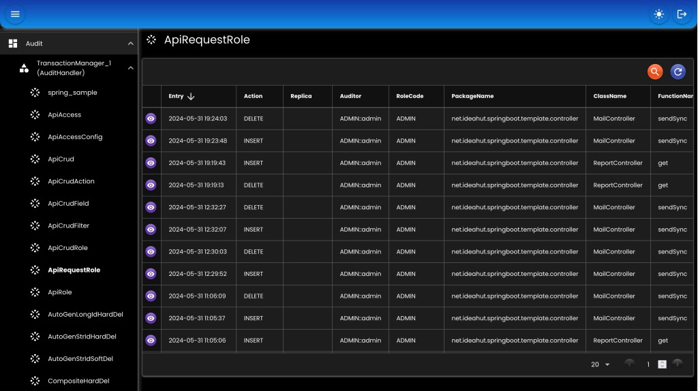

# Audit

- Untuk menyimpan perubahan data entity / model.
- Yang disimpan tanggal perubahan, pengubah / user, aksi (INSERT / UPDATE / DELETE), dan data perubahan.
- Proses penyimpanan dilakukan secara asinkronus.

``` java
public interface AuditHandler {
	void save(String action, Object object);
	
	AuditRequest getRequest(byte[] data);
	Page getList(AuditRequest auditRequest);
	byte[] getBytes(String manager, String id);
	
	Map<String, AuditAccessible> getAccessibles();
}

public class AuditRequest {
    private String manager;
	private String entity;
	private String type;
	private Page page;
	private List<Filter> filters;
	private StringSet orders;
	private Class<?> classOfEntity;
}
```

## Multi

Semua table entity (yang ada anotasi @Audit) akan diduplikat, ditambah dengan field tanggal (entry), pengubah (auditor), informasi tambahan (info), dan aksi (action).

``` java
@Bean
AuditHandler auditHandler(
    EntityTrxManager entityTrxManager,
    TaskHandler taskHandler
) {
    return new DatabaseMultiAuditHandler()
    .setEntityTrxManager(entityTrxManager)
    .setProperties(appProperties.getAudit().getProperties())
    .setTaskHandler(taskHandler)
    .setRejectNonAuditEntity(true);
}
```

## Single

Satu TransactionManager hanya disimpan ke satu table. Jadi semua perubahan entity / model akan disimpan ke satu table.

``` java
@Bean
AuditHandler auditHandler(
    EntityTrxManager entityTrxManager,
    TaskHandler taskHandler
) {
    return new DatabaseSingleAuditHandler()
    .setEntityTrxManager(entityTrxManager)
    .setProperties(appProperties.getAudit().getProperties())
    .setTaskHandler(taskHandler);
}
```

## Properties

``` java
public class DatabaseAuditProperties implements Serializable { 
    private Table table;
    private Column column;
    private Enable enable;
    private Generate generate; 
    private Length length;
 
    @Setter
    @Getter
    public static class Table implements Serializable {
        private String prefix; // prefix nama table yang akan digenerate
        private String suffix; // suffix nama table yang akan digenerate
    }  
 
    @Setter
    @Getter
    public static class Column implements Serializable {
        private String id;      // nama kolom id (Single)
		private String type;    // nama kolom type (Single)
		private String replica; // nama kolom replica (Multi & Single)
		private String auditor; // nama kolom auditor (Multi & Single)
		private String action;  // nama kolom action (Multi & Single)
		private String info;    // nama kolom info (Multi & Single)
		private String content; // nama kolom content (Single)
		private String bytes;   // nama kolom bytes (Single)
		private String entry;   // nama kolom entry (Multi & Single)
    }
 
    @Setter
    @Getter
    public static class Length implements Serializable {
        private Integer id;         // panjang karakter kolom id
        private Integer type;       // panjang karakter kolom type
        private Integer action;     // panjang karakter kolom action
        private Integer auditor;    // panjang karakter kolom auditor
        private Integer info;       // panjang karakter kolom info
    }
 
    @Setter
    @Getter
    public static class Enable implements Serializable {
       private Boolean audit;  // enable audit
       private Boolean rowid;  // enable rowid
       private Boolean index;  // enable index (index akan dibuat di table audit)
       private Boolean any;
    }  
 
    @Setter
    @Getter
    public static class Generate implements Serializable {
       private Boolean table;          // otomatis buat table atau tidak
       private Integer maxPrecision;   // maksimum precision
       private Integer maxScale;       // maksimum scale
    }
 
}
```

## Screenshot

<div>
   
</div>

##

### [Index](./index.md)
