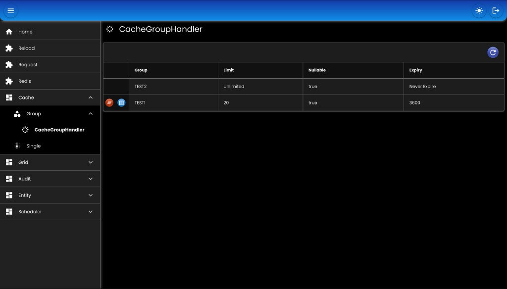

# Cache

Menyimpan data ke memori atau redis.

``` java
// SINGLE
public interface CacheHandler {
	<T> T get(Class<T> type, String key, Callable<T> callable);	
	<T> T get(Class<T> type, String key);	
	<T> T put(Class<T> type, String key, T value);
	void expire(String key, TimeValue expiry);
	void delete(String key);
	Long size(); // size = -1 -> unlimited
	void clear();
	List<String> keys();
	<T> List<T> multiList(Class<T> type, Collection<String> keys);
	<T> Map<String, T> multiMap(Class<T> type, Collection<String> keys);
	void multiDel(Collection<String> keys);
}

// GROUP
public interface CacheGroupHandler {
	<T> T get(Class<T> type, String group, String key, Callable<T> callable);	
	<T> T get(Class<T> type, String group, String key);	
	<T> T put(Class<T> type, String group, String key, T value);
	void expire(String group, String key, TimeValue expiry);
	void delete(String group, String key);	
	Long size(String group); // size = -1 -> unlimited	
	void clear(String group);	
	List<String> keys(String group);
	<T> List<T> multiList(Class<T> type, String group, Collection<String> keys);
	<T> Map<String, T> multiMap(Class<T> type, String group, Collection<String> keys);
	void multiDel(String group, Collection<String> keys);
}

```

## Bean

``` java
// SINGLE
@Bean
CacheHandler cacheHandler(
    AppProperties appProperties,
    BinarySerializer binarySerializer,
    RedisTemplate<String, byte[]> redisTemplate,
    TaskHandler taskHandler
) {
    CacheGroupDefinition cache = ObjectHelper.useOrDefault(
        appProperties.getCache(), 
        CacheGroupDefinition::new
    );
    if (Boolean.TRUE.equals(cache.getUseLocalMemory())) {
        return new MemoryCacheHandler()
        .setBinarySerializer(binarySerializer)
        .setExpiryCheckInterval(TimeValue.of(TimeUnit.SECONDS, 30L))
        .setLimit(100)
        .setNullable(true)
        .setTaskHandler(taskHandler);
    } else {
        return new RedisCacheHandler()
        .setBinarySerializer(binarySerializer)
        .setLimit(100)
        .setNullable(true)
        .setRedisParam(
            new RedisParam<String, byte[]>()
            .setPrefix("SINGLE")
            .setRedisTemplate(redisTemplate)
        )
        .setTaskHandler(taskHandler);
    }
}

// GROUP
@Bean
CacheGroupHandler cacheGroupHandler(
    AppProperties appProperties,
    BinarySerializer binarySerializer,
    RedisTemplate<String, byte[]> redisTemplate,
    TaskHandler taskHandler
) {
    CacheGroupDefinition cache = ObjectHelper.useOrDefault(
        appProperties.getCache(), 
        CacheGroupDefinition::new
    );
    if (Boolean.TRUE.equals(cache.getUseLocalMemory())) {
        return new MemoryCacheGroupHandler()
        .setBinarySerializer(binarySerializer)
        .setGroups(cache.getGroups())
        .setTaskHandler(taskHandler);
    } else {
        return new RedisCacheGroupHandler()
        .setBinarySerializer(binarySerializer)
        .setGroups(cache.getGroups())
        .setRedisParam(
            new RedisParam<String, byte[]>(cache.getStorageKeyParam())
            .setRedisTemplate(redisTemplate)
        )
        .setTaskHandler(taskHandler);
    }
}
```

### Properties

``` md
cache:
    groups:
        -
            name: TEST1
            limit: 20
            expiry:
                unit: SECONDS
                value: 3600
            nullable: true
        -
            name: TEST2
            limit: 0
            expiry:
                unit: SECONDS
                value: 0
            nullable: true
```

* `name`: nama group.
* `limit`: maksimal jumlah key yang disimpan, untuk unlimited diisi 0.
* `expiry`: waktu kadaluarsa, untuk unlimited diisi 0.
* `nullable`: data null disimpan atau tidak.

## Screenshot

<div>
   
</div>

##

### [Index](./index.md)
