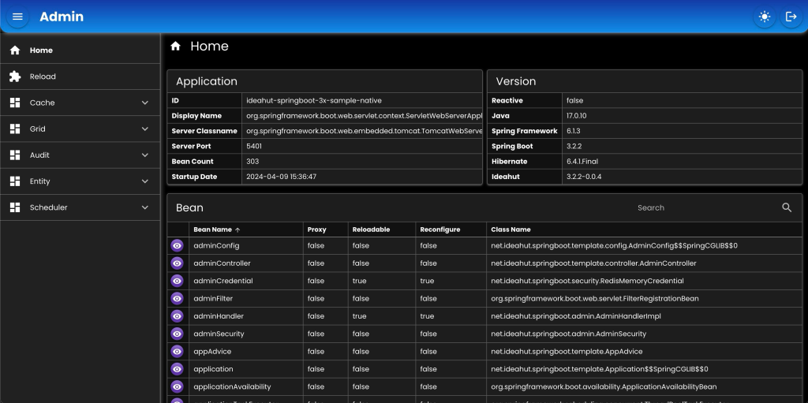

# Admin

<div align="left">
   
</div>

Untuk mengakses API dan halaman Admin, yang berguna untuk manajemen service:
* `Reload` memuat ulang bean tanpa harus merestart service.
* `Cache` menghapus / membersihkan data cache baik itu group maupun tunggal.
* `Grid` mengakses table-table database (operasi CRUD).
* `Audit` melihat perubahan-perubahan data dari tabel-tabel database (INSERT, UPDATE, DELETE).
* `Entity` melihat daftar entity/model yang tersedia berdasarkan transactionManager, termasuk untuk membuat replica & grid.
* `Scheduler` memonitor job, schedule/unschedule job, start/stop scheduler.

## Bean
``` java
@Bean
protected AdminHandler adminHandler(
    DataMapper dataMapper,
    @Qualifier(AppConstants.Bean.Redis.COMMON) RedisTemplate<String, byte[]> redisTemplate
) {
    AppProperties.Admin admin = appProperties.getAdmin();
    return new AdminHandlerImpl()
    .setApplicationContext(applicationContext)
    .setConfigFile(admin.getConfigFile())
    .setDataMapper(dataMapper)
    .setGridAdditionals(GridSupport.getAdditionals())
    .setGridOptions(GridSupport.getOptions())
    .setProperties(admin)
    .setRedisTemplate(redisTemplate);
}

@Bean(name = AppConstants.Bean.Credential.ADMIN)
protected RedisMemoryCredential adminCredential(
    DataMapper dataMapper,
    @Qualifier(AppConstants.Bean.Redis.COMMON) RedisTemplate<String, byte[]> redisTemplate
) {
    AppProperties.Admin admin = appProperties.getAdmin();
    return new RedisMemoryCredential()
    .setConfigFile(admin.getCredentialFile())
    .setDataMapper(dataMapper)
    .setRedisPrefix("ADMIN-CREDENTIAL")
    .setRedisTemplate(redisTemplate);
}

@Bean(name = AppConstants.Bean.Security.ADMIN)
protected AdminSecurity adminSecurity(
    DataMapper dataMapper,
    AdminHandler adminHandler,
    @Qualifier(AppConstants.Bean.Credential.ADMIN) SecurityCredential credential
) {
    return new AdminSecurity()
    .setCredential(credential)
    .setDataMapper(dataMapper)
    //.setEnableRemoteHost(true)
    //.setEnableUserAgent(true)
    .setProperties(adminHandler.getProperties());
}
```

## Konfigurasi
``` js
{
	"api": {
		"requestPath": "/admin"
	},
	"resource": {
		"requestPath": "/_",
		"locations": "file:{user.dir}/extras/admin/resource/",
		"indexFile": "index.html",
		"alwaysToIndex": true,
		"allowedPaths": ["css", "fonts", "icons", "img", "js"]
	},
	"grid": {
		"location": "file:{user.dir}/extras/admin/grid/**/*.json"
	},
	"crud": {
		"maxLimit": 200,
		"useNative": false
	}
}
```

## Kredensial
``` js
{
	"passwordType": "bcrypt",
	"redisExpiry": 15,
	"users": [
		{
			"username": "admin",
			"password": "$2a$10$NL8fAwz/UG6FCk6sEo10Ueuihe.oiX4DQHN4OWqXmDUM9.4Hnu8EC"
		},
		{
			"username": "mimin",
			"password": "$2a$10$uIAtTYQcSsXOR7xABu/gwOLqf3mOde7z2vZVqug3OjItsdKrmuc5m"
		}
	]
}
```

## Controller
### Mvc
``` java
@RestController
@RequestMapping("/admin")
class AdminController extends net.ideahut.springboot.admin.AdminController {
	
	@Autowired
	private DataMapper dataMapper;
	@Autowired
	private AdminHandler adminHandler;
	
	@Override
	protected AdminHandler adminHandler() {
		return adminHandler;
	}

	@Override
	protected DataMapper dataMapper() {
		return dataMapper;
	}	

}
```
### Reactive
``` java
@RestController
@RequestMapping("/admin")
class AdminController extends net.ideahut.springboot.admin.ReactiveAdminController {
	
	@Autowired
	private DataMapper dataMapper;
	@Autowired
	private AdminHandler adminHandler;
	
	@Override
	protected AdminHandler adminHandler() {
		return adminHandler;
	}

	@Override
	protected DataMapper dataMapper() {
		return dataMapper;
	}	

}
```

## Static Resource

### Mvc
``` java
@Configuration
@EnableWebMvc
class WebMvcConfig extends BasicWebMvcConfig {
	@Override
	public void addResourceHandlers(ResourceHandlerRegistry registry) {
		AdminProperties.Resource resource = adminHandler.getProperties().getResource();
		registry
		.addResourceHandler(resource.getRequestPath() + "/**")
		.addResourceLocations(resource.getLocations())
		.setCacheControl(CacheControl.maxAge(60, TimeUnit.DAYS))
		.resourceChain(false)
		.addResolver(new VersionResourceResolver().addContentVersionStrategy(resource.getRequestPath() + "/**"));
		super.addResourceHandlers(registry);
	}
}
```

### Reactive
``` java
@Configuration
@EnableWebFlux
class WebFluxConfig extends BasicWebFluxConfig {
	@Override
	public void addResourceHandlers(ResourceHandlerRegistry registry) {
		AdminProperties.Resource resource = adminHandler.getProperties().getResource();
		registry
		.addResourceHandler(resource.getRequestPath() + "/**")
		.addResourceLocations(resource.getLocations())
		.setCacheControl(CacheControl.maxAge(60, TimeUnit.DAYS))
		.resourceChain(false)
		.addResolver(new VersionResourceResolver().addContentVersionStrategy(resource.getRequestPath() + "/**"));
		super.addResourceHandlers(registry);
	}
}
```