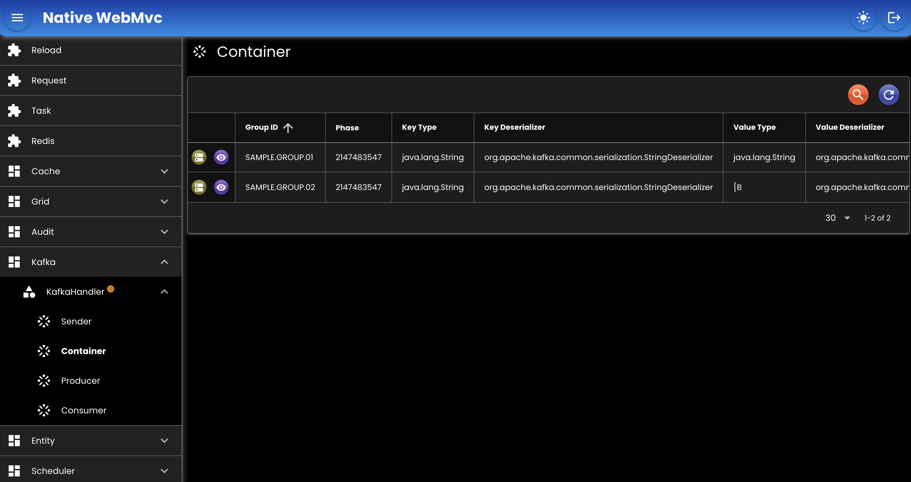

# Kafka
Untuk meng-_handle_ producer dan consumer kafka.
## Bean

``` java
@Bean
KafkaHandler kafkaHandler(
    AppProperties appProperties
) {
    return new KafkaHandlerImpl()
    .setProperties(null)
    .setConfigurationFile(appProperties.getKafkaConfigurationFile());
}
```

- `setProperties`: Kafka properties, atau bisa juga menggunakan configuration file.
- `setConfigurationFile`: Kafka properties yang disimpan ke file, [contoh file](./assets/kafka.yaml).

## Screenshot

<div>
   
</div>

##

### [Index](./index.md)
