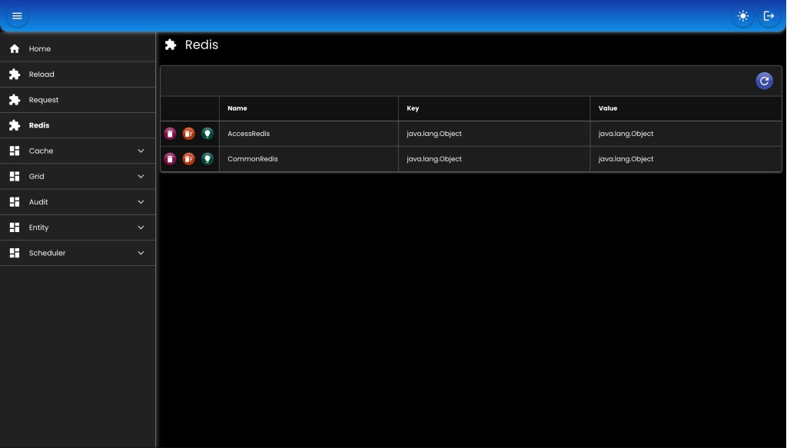

# Redis

## Bean

``` java
@Bean
RedisTemplate<String, byte[]> commonRedis() throws Exception {
    RedisProperties properties = appProperties.getRedis().getCommon();
    RedisConnectionFactory connectionFactory = RedisHelper.createRedisConnectionFactory(properties, true);
    return RedisHelper.createRedisTemplate(connectionFactory, false);
}
```

## Type

* `0`: standalone
* `1`: cluster
* `2`: sentinel

## Contoh Properties

``` md
common:
    type: 0
    standalone:
        host: 127.0.0.1
        port: 6379
        password: "<password>"
        database: 0
```

## Screenshot

<div>
   
</div>

##

### [Index](./index.md)
