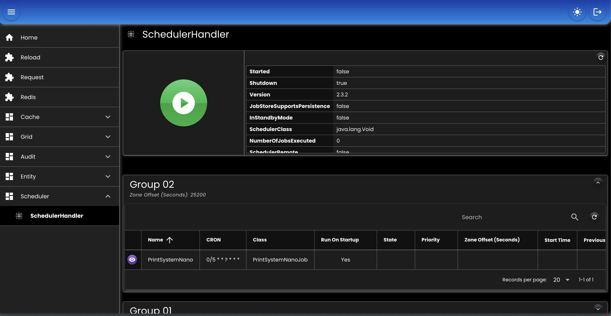
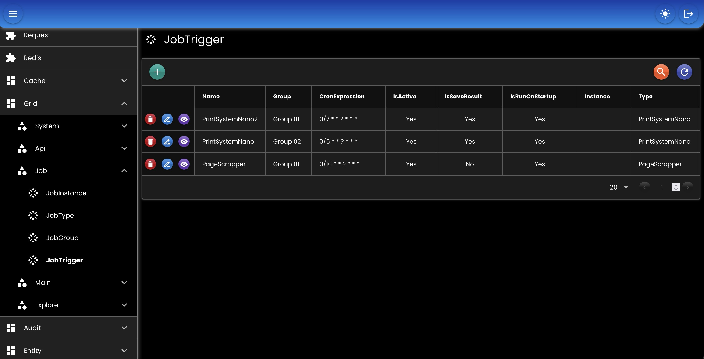

# Scheduler

* Menangani job-job yang bekerja di latar belakang (background)
* Load bisa dibagi berdasarkan instance yang ada
* Proses start, stop, & pause bisa dilakukan di UI admin

## Bean

``` java
@Bean
SchedulerHandler schedulerHandler(
    DataMapper dataMapper,
    EntityTrxManager entityTrxManager,
    TaskHandler taskHandler
) {
    return new SchedulerHandlerImpl()
    .setEntityClass(new JobEntityClass()
       .setTrxManagerName(null)
       .setGroup(JobGroup.class)
       .setInstance(JobInstance.class)
       .setTrigger(JobTrigger.class)
       .setTriggerConfig(JobTriggerConfig.class)
       .setType(JobType.class)
       .setTypeParam(JobTypeParam.class)
    )
    .setDataMapper(dataMapper)
    .setEntityTrxManager(entityTrxManager)
    .setInstanceId(null)
    .setJobPackages(Application.Package.APPLICATION + ".job")
    .setTaskHandler(taskHandler);
}
```

## Screenshot

<div align="left">
   
</div>
<div align="left">
   
</div>
