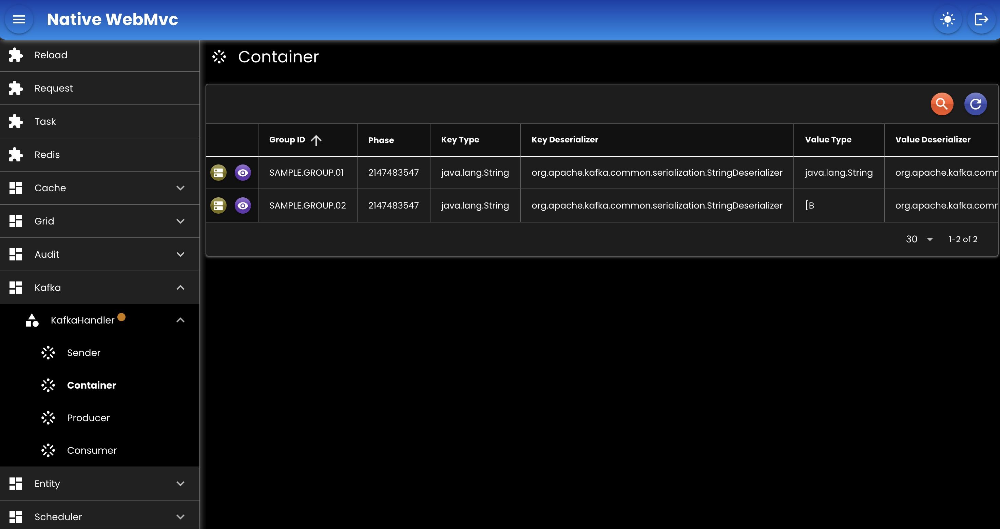

# Kafka
Untuk menangani producer dan consumer kafka.

```java
public interface KafkaHandler {
	KafkaProperties getProperties();
	BinarySerializer getBinarySerializer();
	
	// INTERNAL
	<K, V> KafkaSender<K, V> getSender(String topic);
	<K, V, R> ReplyKafkaSender<K, V, R> getReplySender(String topic);
	
	// DYNAMIC
	<K, V> KafkaSender<K, V> createSender(String topic);
	<K, V, R> ReplyKafkaSender<K, V, R> createReplySender(String topic);
}
```

## Bean

``` java
@Bean
KafkaHandler kafkaHandler(
	AppProperties appProperties,
	BinarySerializer binarySerializer
) {
	KafkaDefinition kafka = appProperties.getKafka().getMessaging();
	return new KafkaHandlerImpl()
	.setBinarySerializer(binarySerializer)
	.setConfigurationFile(kafka.getConfigurationFile())
	.setProperties(kafka.getProperties());
}
```

- `setBinarySerializer`: [BinarySerializer](./03-binary.md) bean.
- `setProperties`: Kafka properties, atau bisa juga menggunakan configuration file.
- `setConfigurationFile`: Kafka properties yang disimpan ke file, [contoh file](./assets/kafka.yaml).

## Screenshot

<div>
   
</div>

##

### [Index](./index.md)
