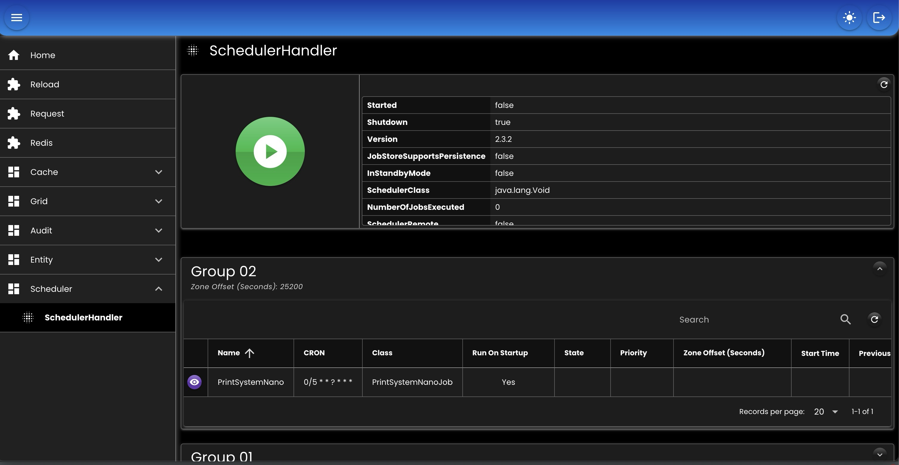
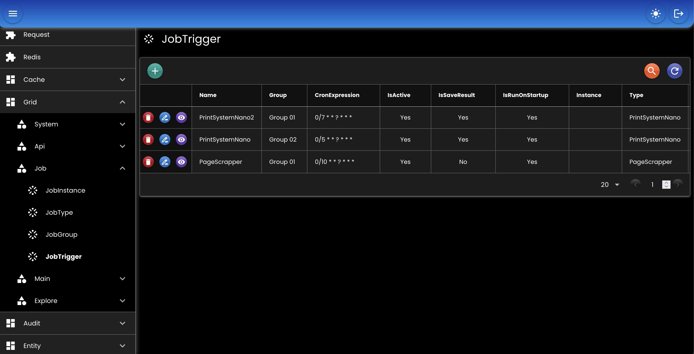

# Scheduler

* Menangani job-job yang bekerja di latar belakang (background).
* Load bisa dibagi berdasarkan instance yang ada.
* Proses start, stop, & pause bisa dilakukan di UI admin.

## Bean

``` java
@Bean
SchedulerHandler schedulerHandler(
   DataMapper dataMapper,
   EntityTrxManager entityTrxManager,
   TaskHandler taskHandler
) {
   return new SchedulerHandlerImpl()
   .setDataMapper(dataMapper)
   .setEntityTrxManager(entityTrxManager)
   .setEntityClass(new JobEntityClass()
      .setTrxManagerName(null)
      .setGroup(JobGroup.class)
      .setInstance(JobInstance.class)
      .setTrigger(JobTrigger.class)
      .setTriggerConfig(JobTriggerConfig.class)
      .setType(JobType.class)
      .setTypeParam(JobTypeParam.class)
   )
   .setTaskHandler(taskHandler)
   .setJobPackages(Application.Package.APPLICATION + ".job")
   .setTraceKey(null)
   .setJobService(null)
   .setSchedulerFactory(null)
   .setInstanceId(null)
   .setOnStart(null)
   .setOnStop(null);
}
```

- `setDataMapper`: [DataMapper](./02-mapper.md) bean.
- `setEntityTrxManager`: [EntityTrxManager](./05-entity.md) bean.
- `setTaskHandler`: [TaskHandler](./11-task.md) bean.
- `setEntityClass`: Daftar entity class yang digunakan (default dari package '_net.ideahut.springboot.job.entity_').
- `setJobPackages`: List package class-class job.
- `setJobService`: Custom JobService.
- `setSchedulerFactory`: Custom SchedulerFactory.
- `setInstanceId`: ID instance scheduler (default dari property '_spring.application.name_'). 
- `setTraceKey`: key yang digunakan di log [MDC](https://logback.qos.ch/manual/mdc.html).
- `setOnStart`: Runnable yang dieksekusi pada saat _start_.
- `setOnStop`: Runnable yang dieksekusi pada saat _stop_.


## Screenshot

<div>
   
</div>
<div>
   
</div>

##

### [Index](./index.md)
