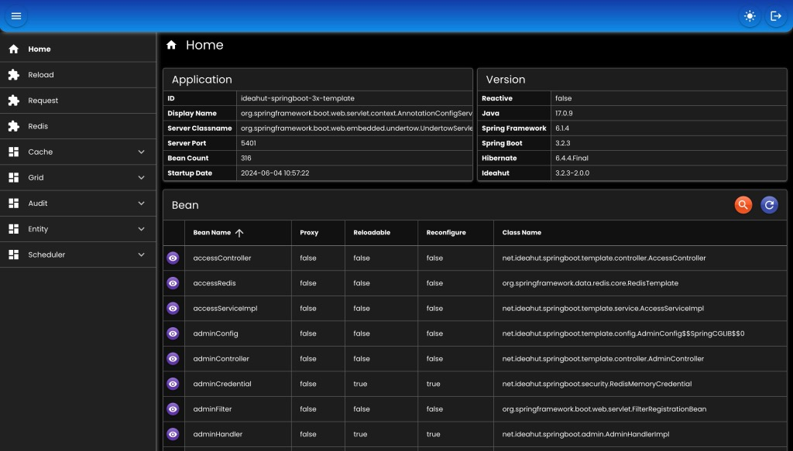
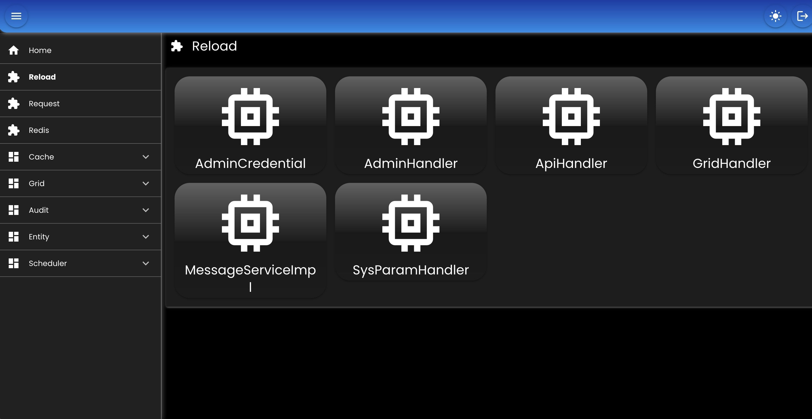

# Admin

Untuk mengakses API dan halaman Admin, yang berguna untuk manajemen service:

* `Reload`: memuat ulang bean tanpa harus merestart service.
* `Request`: daftar request mapping yang tersedia di service.
* `Redis`: daftar redis server yang digunakan di service.
* `Cache`: menghapus / membersihkan data cache baik itu group maupun tunggal.
* `Grid`: mengakses table-table database (operasi CRUD).
* `Audit`: melihat perubahan-perubahan data dari tabel-tabel database (INSERT, UPDATE, DELETE).
* `Entity`: melihat daftar entity / model yang tersedia berdasarkan transactionManager, termasuk untuk membuat replica & grid.
* `Scheduler`: memonitor job, schedule / unschedule job, start / stop scheduler.

## Bean

``` java
// ADMIN HANDLER
@Bean
AdminHandler adminHandler(
   AppProperties appProperties,
   ApplicationContext applicationContext,
   BinarySerializer binarySerializer,
   RedisTemplate<String, byte[]> redisTemplate,
   RestHandler restHandler
) {
   AdminDefinition.Handler handler = ObjectHelper.callOrElse(
      appProperties.getAdmin() != null && appProperties.getAdmin().getHandler() != null, 
      () -> appProperties.getAdmin().getHandler(), 
      AdminDefinition.Handler::new
   );
   return new AdminHandlerImpl()
         
   // Memperbaharui data-data di javascript & html resource admin sesuai dengan konfigurasi, seperti: judul, timeout, dll
   .setAfterReload(h -> ModuleAdmin.afterReload(h, applicationContext, ""))
   
   // Path untuk mengakses API Admin
   .setApiPath(handler.getApiPath())
   
   // Serialize & deserialize byte array ke redis
   .setBinarySerializer(binarySerializer)
   
   // Custom cek token ke central, secara default sudah tersedia
   //.setCheckTokenCentral(null)
   
   // Lokasi konfigurasi file untuk fitur admin
   .setConfigurationFile(handler.getConfigurationFile())
   
   // Daftar array yang digunakan di template grid, contoh: DAYS, MONTHS, dll
   .setGridAdditionals(GridSupport.getAdditionals())
   
   // Daftar option select ynag digunakan di template grid, contoh: GENDER, BOOLEAN, dll
   .setGridOptions(GridSupport.getOptions())
   
   // Untuk menerjemahkan judul, deskripsi, dll yang ada di template grid
   .setMessageHandler(null)
   
   // Opsi AdminProperties jika configuration file tidak di-set
   .setProperties(null)
   
   // Untuk menyimpan data-data admin, seperti: template grid, authorization, dll
   .setRedisTemplate(redisTemplate)
   
   // Menggunakan nama bean, jika RequestMappingHandlerMapping di application context lebih dari satu
   //.setRequestMappingHandlerMappingBeanName(null)
   
   // Untuk sinkronisasi ke central
   .setRestHandler(restHandler)
   
   // Mekanisme penyimpanan key di storage (redis / local memory)
   .setStorageKeyParam(handler.getStorageKeyParam())
   
   // Custom sinkronisasi ke central, secara default sudah tersedia 
   //.setSyncToCentral(null)
   
   // Umur cache resource Admin UI
   .setWebCacheMaxAge(handler.getWebCacheMaxAge())
   
   // Flag Admin UI bisa diakses atau tidak
   .setWebEnabled(handler.getWebEnabled())
   
   // Lokasi resource Admin UI
   .setWebLocation(handler.getWebLocation())
   
   // Context Path untuk mengakses Admin UI
   .setWebPath(handler.getWebPath())
   
   // Flag resource chain atau tidak
   .setWebResourceChain(handler.getWebResourceChain());
   
}

// ADMIN CREDENTIAL
@Bean
SecurityCredential adminCredential(
   AppProperties appProperties,
   BinarySerializer binarySerializer,
   RedisTemplate<String, byte[]> redisTemplate
) {
   AdminDefinition.Credential credential = ObjectHelper.callOrElse(
      appProperties.getAdmin() != null && appProperties.getAdmin().getCredential() != null, 
      () -> appProperties.getAdmin().getCredential(), 
      AdminDefinition.Credential::new
   );
   if (Boolean.TRUE.equals(credential.getUseLocalMemory())) {
      
      // Local Memory
      return new LocalMemoryCredential()
            
      // Serialize & deserialize byte array di local memory
      .setBinarySerializer(binarySerializer)
            
      // Cek yang sudah kadaluarsa
      .setCheckInterval(credential.getCheckInterval())
      
      // Lokasi file kredensial
      .setCredentialFile(credential.getCredentialFile())
      
      // Optional, jika tidak didefinisikan di credential file
      .setExpiry(credential.getExpiry())
      
      // Optional, jika tidak didefinisikan di credential file
      .setPasswordType(credential.getPasswordType())
      
      // Optional, jika tidak didefinisikan di credential file
      .setUsers(credential.getUsers());
      
   } else {
      
      // Redis memory
      return new RedisMemoryCredential()
      
      // Serialize & deserialize byte array di redis	
      .setBinarySerializer(binarySerializer)
      
      // Lokasi file kredensial
      .setCredentialFile(credential.getCredentialFile())
      
      // Optional, jika tidak didefinisikan di credential file
      .setExpiry(credential.getExpiry())
      
      // Optional, jika tidak didefinisikan di credential file
      .setPasswordType(credential.getPasswordType())
      
      // RedisTemplate dan definisi penyimpanan key-nya
      .setRedisParam(
         new RedisParam<String, byte[]>(credential.getStorageKeyParam())
         .setRedisTemplate(redisTemplate)
      )
      
      // Optional, jika tidak didefinisikan di credential file
      .setUsers(credential.getUsers());
   }
}

// ADMIN SECURITY
@Bean
WebMvcSecurity adminSecurity(
   AppProperties appProperties,
   DataMapper dataMapper,
   AdminHandler adminHandler,
   SecurityCredential credential
) {
   AdminDefinition.Security security = ObjectHelper.callOrElse(
      appProperties.getAdmin() != null && appProperties.getAdmin().getSecurity() != null, 
      () -> appProperties.getAdmin().getSecurity(), 
      AdminDefinition.Security::new
   );
   if (Boolean.TRUE.equals(security.getUseBasicAuth())) {
      
      // Basic Auth
      return new WebMvcBasicAuthSecurity()
            
      // Credential
      .setCredential(credential)
      
      // Realm, ditampilkan di-popup browser
      .setRealm(security.getRealm());
      
   } else {
      
      // Berdasarkan AdminHandler
      return new WebMvcAdminSecurity()
            
      // Admin handler		
      .setAdminHandler(adminHandler)
      
      // Credential
      .setCredential(credential)
      
      // DataMapper
      .setDataMapper(dataMapper)
      
      // Pengecekan host yang diperoleh pada saat login
      .setEnableRemoteHost(security.getEnableRemoteHost())
      
      // Pengecekan User-Agent yang diperoleh pada saat login
      .setEnableUserAgent(security.getEnableUserAgent())
      
      // Http header untuk menyimpan token, default: 'Authorization'
      .setHeaderKey(security.getHeaderKey());
   }
}
```

## Konfigurasi

``` yaml
# Tunggu semua job selesai pada saat stop scheduler
waitForJobsToCompleteWhenStopScheduler: false

# Ambil metadata dari database
collectDatabaseMetadata: true

# Hanya tampilkan Redis yang bisa dieksekusi
showOnlyExecutableRedis: true

central:
   # Untuk mengambil file template terbaru yang akan diubah sesuai konfigurasi admin
   webEndpoint: "https://central.ideahut.net/sync/web"

   # Untuk mengecek token jika halaman admin dibuka dari central
   tokenEndpoint: "https://central.ideahut.net/sync/token"

# konfigurasi API admin yang akan diset di file template
api:
   timeout: 30
   debug: true

# konfigurasi Web UI yang akan diset di file template
web:
   title: "Template WebMvc (Native)"
   indexFile: "index.html"
   alwaysToIndex: true
   color:
      ## css color
      header: ""
      title: ""
      primary: ""
      secondary: ""
      accent: ""
      dark: ""
      positive: ""
      negative: ""
      info: ""
      warning: ""
   allowedPaths:
      ## path yang diizinkan untuk diakses
      - "assets"
      - "icons"
      - "favicon.ico"
      - "index.html"

grid:
   enable: true
   location: "file:{user.dir}/extras/admin/grid/**/*.yaml"
   definition: "file:{user.dir}/extras/admin/grid/grid.def"

crud:
   maxLimit: 200
   useNative: false

role:
   definitionFile: "file:{user.dir}/extras/admin/roles.yaml"

# custom module, seperti: title, urutan / order di menu, aktif / tidak, dan path jika ada custom di controller
modules:
   reload:
      #title:
      #enable:
      #order:
      #path:
   cache: null
   redis: null
   grid: null
   audit: null
   entity: null
   scheduler: null
   task: null
   request: null
```

## Role
Admin user secara default bisa mengakses semua fitur jika role-nya tidak ada.
``` yaml
VIEWER:
   reload:
      enable: false
   redis:
      flushDb: false
      flushAll: false
      items:
   cache:
      single:
         delete: false
         clear: false
         items:
      group:
         delete: false
         clear: false
         items:
   grid:
      actions:
         - PAGE
      items:
         #system:
         #   SysParam:
         #      - PAGE
         #      - UPDATE
   kafka:
      senderControl: false
      containerControl: false
      groupDelete: false
   scheduler:
      control: false
      resetRunning: false
      resetLocking: false
      pause: false
      schedule: false
      trigger: false
```

## Kredensial

``` yaml
# Tipe password: bcrypt, sha-XXX, md-XXX
passwordType: "bcrypt"

# waktu kadaluarsa user yang login
expiry:
   unit: "MINUTES"
   value: 30
   
users:
   -
      username: "admin"
      password: "$2a$10$NL8fAwz/UG6FCk6sEo10Ueuihe.oiX4DQHN4OWqXmDUM9.4Hnu8EC"
      # Bisa mengakses semua fitur admin
   -
      username: "mimin"
      password: "$2a$10$uIAtTYQcSsXOR7xABu/gwOLqf3mOde7z2vZVqug3OjItsdKrmuc5m"
      # hanya bisa akses fitur yang didefinisikan di role VIEWER
      role: "VIEWER"
```

## Controller

``` java
// WebMvc
@ApiExclude
@ComponentScan
@RestController
@RequestMapping("/_/api")
class AdminController extends net.ideahut.springboot.admin.WebMvcAdminController {
	private final DataMapper dataMapper;
	private final AdminHandler adminHandler;
	private final WebMvcSecurity webMvcSecurity;
	
	@Autowired
	AdminController(
		DataMapper dataMapper,
		AdminHandler adminHandler,
		WebMvcSecurity webMvcSecurity
	) {
		this.dataMapper = dataMapper;
		this.adminHandler = adminHandler;
		this.webMvcSecurity = webMvcSecurity;
	}
	
	@Override
	protected DataMapper dataMapper() {
		return dataMapper;
	}
	
	@Override
	protected AdminHandler adminHandler() {
		return adminHandler;
	}
	
	@Override
	protected WebMvcSecurity webMvcSecurity() {
		return webMvcSecurity;
	}
}

// WebFlux
@ApiExclude
@ComponentScan
@RestController
@RequestMapping("/_/api")
class AdminController extends net.ideahut.springboot.admin.WebFluxAdminController {
	private final DataMapper dataMapper;
	private final AdminHandler adminHandler;
	private final WebFluxSecurity webFluxSecurity;
	
	@Autowired
	AdminController(
		DataMapper dataMapper,
		AdminHandler adminHandler,
		WebFluxSecurity webFluxSecurity
	) {
		this.dataMapper = dataMapper;
		this.adminHandler = adminHandler;
		this.webFluxSecurity = webFluxSecurity;
	}
	
	@Override
	protected DataMapper dataMapper() {
		return dataMapper;
	}
	
	@Override
	protected AdminHandler adminHandler() {
		return adminHandler;
	}

	@Override
	protected WebFluxSecurity webFluxSecurity() {
		return webFluxSecurity;
	}
}
```

## Static Resource

``` java
// WebMvc
@Configuration
@EnableWebMvc
class WebMvcConfig extends net.ideahut.springboot.config.WebMvcBasicConfig {
    @Autowired
    private AdminHandler adminHandler;

    @Override
    public void addResourceHandlers(ResourceHandlerRegistry registry) {
       AdminProperties.Resource resource = adminHandler.getProperties().getResource();
       if (resource != null) {
           registry
           .addResourceHandler(resource.getRequestPath() + "/**")
           .addResourceLocations(resource.getLocations())
           .setCacheControl(CacheControl.maxAge(60, TimeUnit.DAYS))
           .resourceChain(false)
           .addResolver(new VersionResourceResolver().addContentVersionStrategy(resource.getRequestPath() + "/**"));
       }
       super.addResourceHandlers(registry);
    }
}

// WebFlux
@Configuration
@EnableWebFlux
class WebFluxConfig extends net.ideahut.springboot.config.WebFluxBasicConfig {
    @Autowired
    private AdminHandler adminHandler;

    @Override
    public void addResourceHandlers(ResourceHandlerRegistry registry) {
       AdminProperties.Resource resource = adminHandler.getProperties().getResource();
       if (resource != null) {
           registry
           .addResourceHandler(resource.getRequestPath() + "/**")
           .addResourceLocations(resource.getLocations())
           .setCacheControl(CacheControl.maxAge(60, TimeUnit.DAYS))
           .resourceChain(false)
           .addResolver(new VersionResourceResolver().addContentVersionStrategy(resource.getRequestPath() + "/**"));
       }
       super.addResourceHandlers(registry);
    }
}
```

## Screenshot

<div>
   
</div>
<div>
   
</div>

##

### [Index](./index.md)
