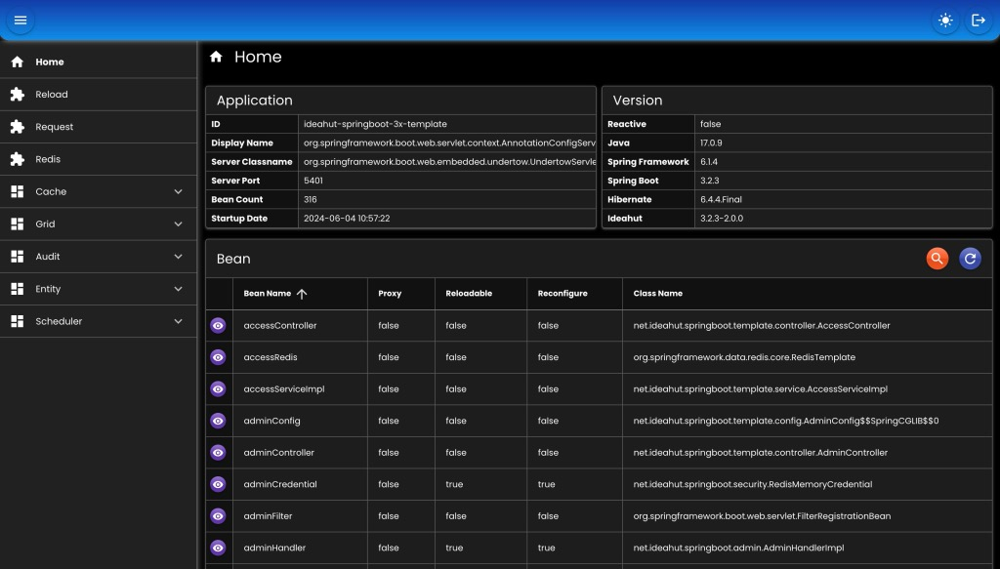
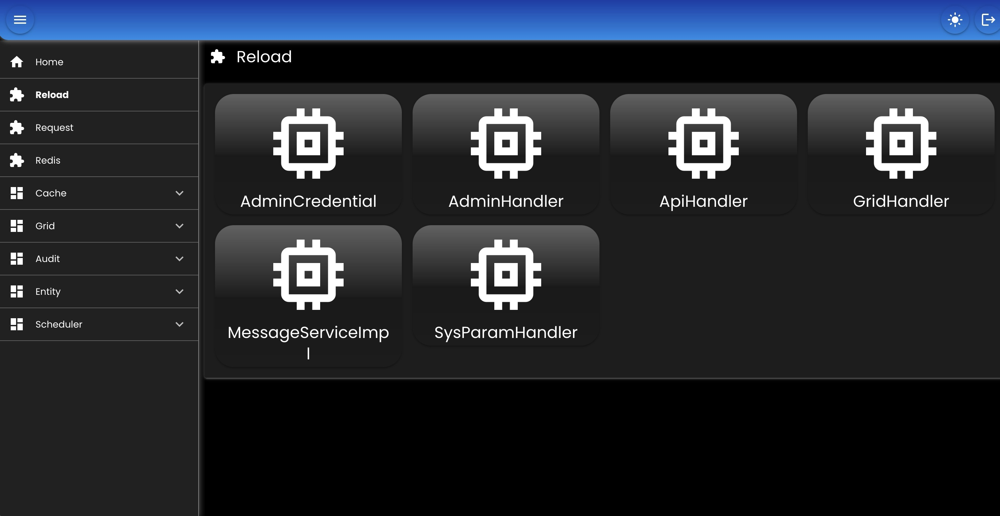

# Admin

Untuk mengakses API dan halaman Admin, yang berguna untuk manajemen service:

* `Reload`: memuat ulang bean tanpa harus merestart service.
* `Request`: daftar request mapping yang tersedia di service.
* `Redis`: daftar redis server yang digunakan di service.
* `Cache`: menghapus / membersihkan data cache baik itu group maupun tunggal.
* `Grid`: mengakses table-table database (operasi CRUD).
* `Audit`: melihat perubahan-perubahan data dari tabel-tabel database (INSERT, UPDATE, DELETE).
* `Entity`: melihat daftar entity/model yang tersedia berdasarkan transactionManager, termasuk untuk membuat replica & grid.
* `Scheduler`: memonitor job, schedule/unschedule job, start/stop scheduler.

## Bean

``` java
@Bean
AdminHandler adminHandler(
    DataMapper dataMapper,
    RedisTemplate<String, byte[]> redisTemplate
) {
    AppProperties.Admin admin = appProperties.getAdmin();
    return new AdminHandlerImpl()
    .setApplicationContext(applicationContext)
    .setConfigFile(admin.getConfigFile())
    .setDataMapper(dataMapper)
    .setGridAdditionals(GridSupport.getAdditionals())
    .setGridOptions(GridSupport.getOptions())
    .setProperties(admin)
    .setRedisTemplate(redisTemplate);
}

@Bean(name = AppConstants.Bean.Credential.ADMIN)
RedisMemoryCredential adminCredential(
    DataMapper dataMapper,
    RedisTemplate<String, byte[]> redisTemplate
) {
    AppProperties.Admin admin = appProperties.getAdmin();
    return new RedisMemoryCredential()
    .setConfigFile(admin.getCredentialFile())
    .setDataMapper(dataMapper)
    .setRedisPrefix("ADMIN-CREDENTIAL")
    .setRedisTemplate(redisTemplate);
}

@Bean(name = AppConstants.Bean.Security.ADMIN)
AdminSecurity adminSecurity(
    DataMapper dataMapper,
    AdminHandler adminHandler,
    SecurityCredential credential
) {
    return new AdminSecurity()
    .setCredential(credential)
    .setDataMapper(dataMapper)
    //.setEnableRemoteHost(true)
    //.setEnableUserAgent(true)
    .setProperties(adminHandler.getProperties());
}
```

## Konfigurasi

``` yaml
# Tunggu semua job selesai pada saat stop scheduler
waitForJobsToCompleteWhenStopScheduler: false

# Ambil metadata dari database
collectDatabaseMetadata: true

# Hanya tampilkan Redis yang bisa dieksekusi
showOnlyExecutableRedis: true

central:
   # Untuk mengambil file template terbaru yang akan diubah sesuai konfigurasi admin
   webEndpoint: "https://central.ideahut.net/sync/web"

   # Untuk mengecek token jika halaman admin dibuka dari central
   tokenEndpoint: "https://central.ideahut.net/sync/token"

# konfigurasi API admin yang akan diset di file template
api:
   timeout: 30
   debug: true

# konfigurasi Web UI yang akan diset di file template
web:
   title: "Template WebMvc (Native)"
   indexFile: "index.html"
   alwaysToIndex: true
   color:
      ## css color
      header: ""
      title: ""
      primary: ""
      secondary: ""
      accent: ""
      dark: ""
      positive: ""
      negative: ""
      info: ""
      warning: ""
   allowedPaths:
      ## path yang diizinkan untuk diakses
      - "assets"
      - "icons"
      - "favicon.ico"
      - "index.html"

grid:
   enable: true
   location: "file:{user.dir}/extras/admin/grid/**/*.yaml"
   definition: "file:{user.dir}/extras/admin/grid/grid.def"

crud:
   maxLimit: 200
   useNative: false

role:
   definitionFile: "file:{user.dir}/extras/admin/roles.yaml"

# custom module, seperti: title, urutan / order di menu, aktif / tidak, dan path jika ada custom di controller
modules:
   reload:
      #title:
      #enable:
      #order:
      #path:
   cache: null
   redis: null
   grid: null
   audit: null
   entity: null
   scheduler: null
   task: null
   request: null
```

## Role
Admin user secara default bisa mengakses semua fitur jika role-nya tidak ada.
``` yaml
VIEWER:
   reload:
      enable: false
   redis:
      flushDb: false
      flushAll: false
      items:
   cache:
      single:
         delete: false
         clear: false
         items:
      group:
         delete: false
         clear: false
         items:
   grid:
      actions:
         - PAGE
      items:
         #system:
         #   SysParam:
         #      - PAGE
         #      - UPDATE
   kafka:
      senderControl: false
      containerControl: false
      groupDelete: false
   scheduler:
      control: false
      resetRunning: false
      resetLocking: false
      pause: false
      schedule: false
      trigger: false
```

## Kredensial

``` yaml
# Tipe password: bcrypt, sha-XXX, md-XXX
passwordType: "bcrypt"

# waktu kadaluarsa user yang login
expiry:
   unit: "MINUTES"
   value: 30
   
users:
   -
      username: "admin"
      password: "$2a$10$NL8fAwz/UG6FCk6sEo10Ueuihe.oiX4DQHN4OWqXmDUM9.4Hnu8EC"
      # Bisa mengakses semua fitur admin
   -
      username: "mimin"
      password: "$2a$10$uIAtTYQcSsXOR7xABu/gwOLqf3mOde7z2vZVqug3OjItsdKrmuc5m"
      # hanya bisa akses fitur yang didefinisikan di role VIEWER
      role: "VIEWER"
```

## Controller

``` java
// WebMvc
@ApiExclude
@ComponentScan
@RestController
@RequestMapping("/_/api")
class AdminController extends net.ideahut.springboot.admin.WebMvcAdminController {
	private final DataMapper dataMapper;
	private final AdminHandler adminHandler;
	private final WebMvcSecurity webMvcSecurity;
	
	@Autowired
	AdminController(
		DataMapper dataMapper,
		AdminHandler adminHandler,
		WebMvcSecurity webMvcSecurity
	) {
		this.dataMapper = dataMapper;
		this.adminHandler = adminHandler;
		this.webMvcSecurity = webMvcSecurity;
	}
	
	@Override
	protected DataMapper dataMapper() {
		return dataMapper;
	}
	
	@Override
	protected AdminHandler adminHandler() {
		return adminHandler;
	}
	
	@Override
	protected WebMvcSecurity webMvcSecurity() {
		return webMvcSecurity;
	}
}

// WebFlux
@ApiExclude
@ComponentScan
@RestController
@RequestMapping("/_/api")
class AdminController extends net.ideahut.springboot.admin.WebFluxAdminController {
	private final DataMapper dataMapper;
	private final AdminHandler adminHandler;
	private final WebFluxSecurity webFluxSecurity;
	
	@Autowired
	AdminController(
		DataMapper dataMapper,
		AdminHandler adminHandler,
		WebFluxSecurity webFluxSecurity
	) {
		this.dataMapper = dataMapper;
		this.adminHandler = adminHandler;
		this.webFluxSecurity = webFluxSecurity;
	}
	
	@Override
	protected DataMapper dataMapper() {
		return dataMapper;
	}
	
	@Override
	protected AdminHandler adminHandler() {
		return adminHandler;
	}

	@Override
	protected WebFluxSecurity webFluxSecurity() {
		return webFluxSecurity;
	}
}
```

## Static Resource

``` java
// WebMvc
@Configuration
@EnableWebMvc
class WebMvcConfig extends net.ideahut.springboot.config.WebMvcBasicConfig {
    @Autowired
    private AdminHandler adminHandler;

    @Override
    public void addResourceHandlers(ResourceHandlerRegistry registry) {
       AdminProperties.Resource resource = adminHandler.getProperties().getResource();
       if (resource != null) {
           registry
           .addResourceHandler(resource.getRequestPath() + "/**")
           .addResourceLocations(resource.getLocations())
           .setCacheControl(CacheControl.maxAge(60, TimeUnit.DAYS))
           .resourceChain(false)
           .addResolver(new VersionResourceResolver().addContentVersionStrategy(resource.getRequestPath() + "/**"));
       }
       super.addResourceHandlers(registry);
    }
}

// WebFlux
@Configuration
@EnableWebFlux
class WebFluxConfig extends net.ideahut.springboot.config.WebFluxBasicConfig {
    @Autowired
    private AdminHandler adminHandler;

    @Override
    public void addResourceHandlers(ResourceHandlerRegistry registry) {
       AdminProperties.Resource resource = adminHandler.getProperties().getResource();
       if (resource != null) {
           registry
           .addResourceHandler(resource.getRequestPath() + "/**")
           .addResourceLocations(resource.getLocations())
           .setCacheControl(CacheControl.maxAge(60, TimeUnit.DAYS))
           .resourceChain(false)
           .addResolver(new VersionResourceResolver().addContentVersionStrategy(resource.getRequestPath() + "/**"));
       }
       super.addResourceHandlers(registry);
    }
}
```

## Screenshot

<div>
   
</div>
<div>
   
</div>

##

### [Index](./index.md)
